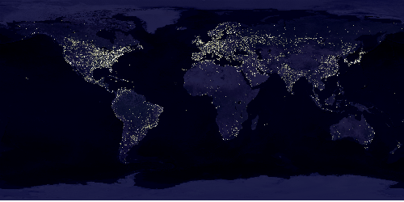

# Rescaling

We implemented rescaling as an application of resampling methods. Multiple resampling methods are available and some offers more customisable parameters. A good reference of different kernels (methods) can be found [here](https://guide.encode.moe/encoding/resampling.html).

| Method | Custom Param | Description |
| :----: | :----------: | :---------: |
| [Point (Box, Nearest Neighbour, NN)](https://en.wikipedia.org/wiki/Comparison_gallery_of_image_scaling_algorithms#Nearest-neighbor_interpolation) | N.A. | Result pixel has a value same to the nearest pixel in the source image space |
| Point With Zero | N.A. | When the result pixel does not have an exact corresponding pixel in the source space, leave it as zero (black). This is meaningful only when the target dimension is of multiples of the source |
| [Bilinear](https://en.wikipedia.org/wiki/Comparison_gallery_of_image_scaling_algorithms#Bilinear_interpolation) | N.A. | Use Linear Interpolation twice in horizontal then vertical direction. Assuming a linear colour model |
| [Mitchell–Netravali filter](https://en.wikipedia.org/wiki/Mitchell–Netravali_filters) or **BC-splines** | B, C | A bicubic method. This is widely used by many image processing softwares, including GIMP, Adobe Photoshop, ImageMagick, etc. For the effectiveness of the params, check the [paper](https://www.cs.utexas.edu/~fussell/courses/cs384g-fall2013/lectures/mitchell/Mitchell.pdf) or a brief description [here](https://en.wikipedia.org/wiki/Mitchell–Netravali_filters#Subjective_effects) |
| [Lanczos](https://en.wikipedia.org/wiki/Lanczos_resampling) | Lobes (or taps) | Another bicubic method. Very high quality for upscaling, very sharp but has slightly more ringing. When used for downscaling, it has a risk of presenting Moiré effects. Increasing the number of lobes improves sharpness at the cost of increased ringing. |

## Gamma-aware Rescaling

Many images formats (including PNG format used in our software) stores images in non-linear RGB model, usually sRGB model; however, many algorithms assume a linear one, especially interpolation kernels. This would cause a WRONG scaling result. In a [extreme case illustrated by Imagemagick Team](https://legacy.imagemagick.org/Usage/resize/#resize_colorspace), a significant visible global dimming effect can be observed. Similar result can be illustrated using our software when check / uncheck "Gamma-aware resizing" option.

### Example

[Raw Image](https://visibleearth.nasa.gov/images/55167/earths-city-lights) (4800 $\times$ 2400, notice that your reader / browser may not resize this image correctly):

Gamma-aware Resizing (500 $\times$ 250):

Non-gamma-aware Resizing (500 $\times$ 250):

